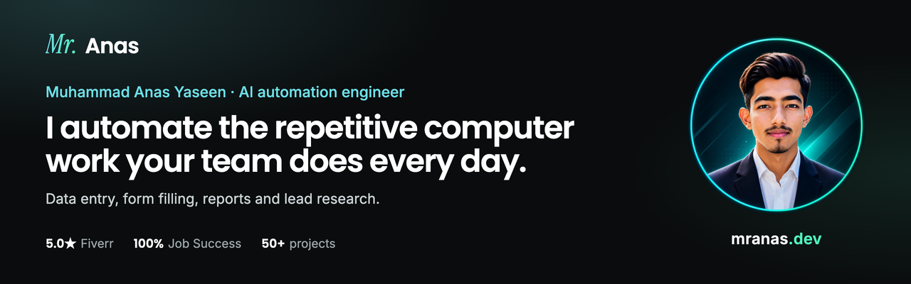
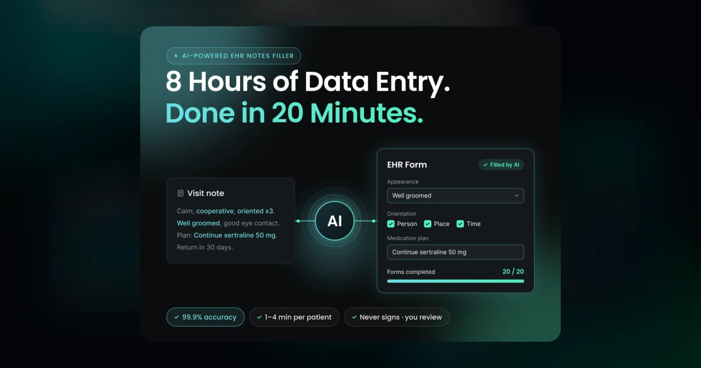
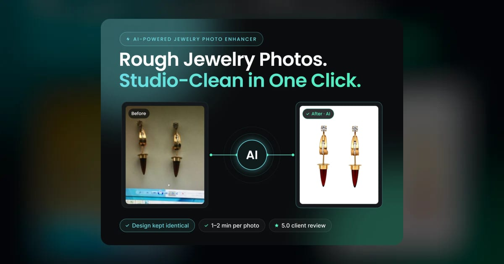
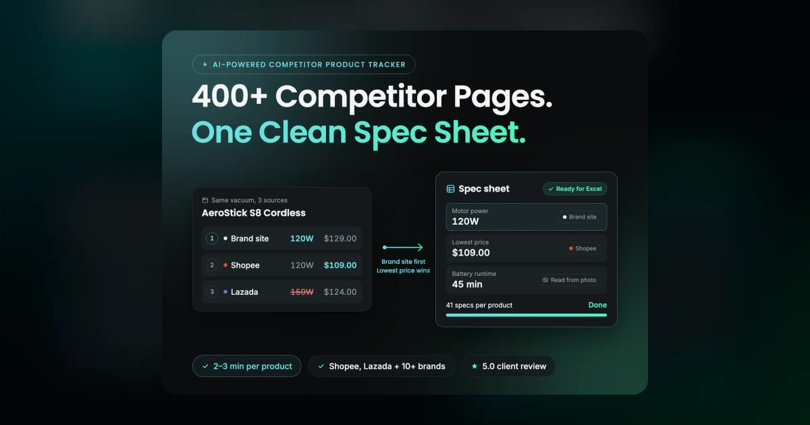
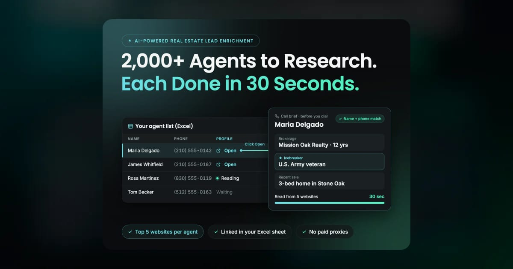
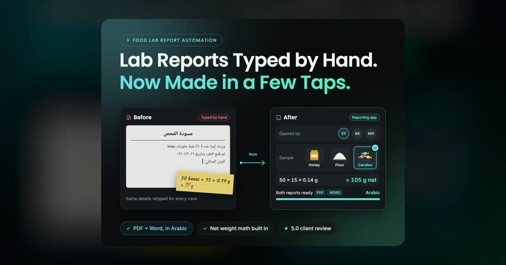
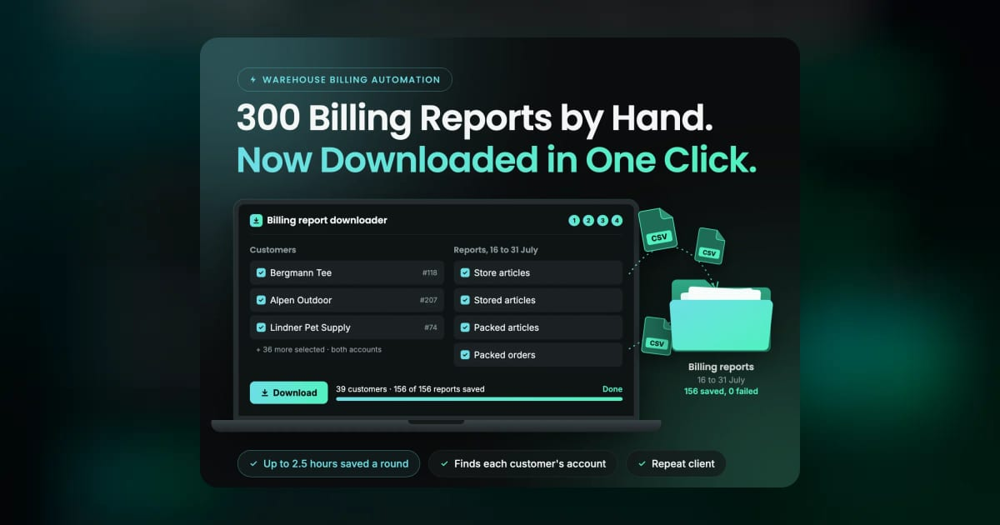
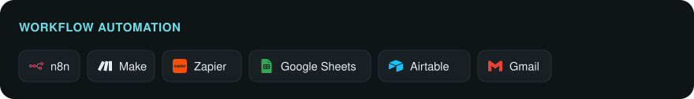
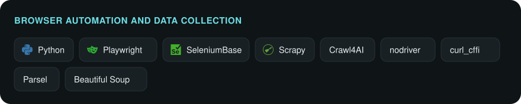
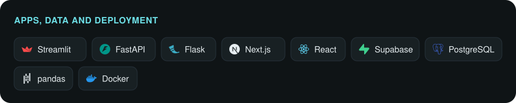

  
  
  
  
  

If your team spends hours on the same computer tasks every week, I can probably automate them: copying data between systems, filling the same forms, downloading reports one by one, researching leads, checking websites for changes.

I start with the fastest option that works. If your apps can already connect, an **n8n, Make or Zapier** workflow keeps the data moving between them. When those tools hit their limits, like a website with no API, a login or bot protection in the way, I build a **custom Python tool** for that exact problem, with a simple dashboard if your team needs one. **AI** goes in where a task needs judgement.

**50+ projects delivered** · **5.0 on Fiverr (Level 2)** · **100% Job Success on Upwork** · clients in the US, Europe and the Middle East

## What I automate

- **Data entry and form filling** in portals, CRMs, EHRs and other web systems
- **Reports, data collection and monitoring**, with alerts when something changes
- **Lead research and enrichment** for sales, real estate and local businesses
- **Data extraction** from websites, including ones with logins, CAPTCHAs or bot protection
- **AI workflows** that read emails, documents and notes and turn them into clean data
- **App connections** with n8n, Make and Zapier

## Selected work

Most client code is private, so these link to the full case studies on [mranas.dev](https://mranas.dev/work).

<table>
  <tr>
    <td width="50%" valign="top">
      
      
<b><a href="https://mranas.dev/work/ehr-notes-filler">AI EHR Notes Filler</a></b> A day of clinical notes in about 20 minutes, not 4 to 8 hours.

    </td>
    <td width="50%" valign="top">
      
      
<b><a href="https://mranas.dev/work/jewelry-photo-enhancer">AI Jewelry Photo Enhancer</a></b> Rough phone photos to clean product shots in 1–2 minutes.

    </td>
  </tr>
  <tr>
    <td width="50%" valign="top">
      
      
<b><a href="https://mranas.dev/work/competitor-product-tracker">AI Competitor Product Tracker</a></b> 400+ product pages turned into one clean spec sheet.

    </td>
    <td width="50%" valign="top">
      
      
<b><a href="https://mranas.dev/work/real-estate-lead-enrichment">AI Real Estate Lead Enrichment</a></b> 2,000+ agents researched, about 30 seconds each.

    </td>
  </tr>
  <tr>
    <td width="50%" valign="top">
      
      
<b><a href="https://mranas.dev/work/food-lab-reporting">Food Lab Reporting App</a></b> Hand-typed lab reports, now a few taps.

    </td>
    <td width="50%" valign="top">
      
      
<b><a href="https://mranas.dev/work/warehouse-billing-reports">Warehouse Billing Reports</a></b> 300 manual downloads, now one click.

    </td>
  </tr>
</table>

<a href="https://mranas.dev/work"><b>See all projects on mranas.dev →</b></a>

## Tools I use

## Work with me

Tell me about the task and the tools you use today. I'll tell you honestly what can be automated and what it will take, and I only take on work I'm sure I can deliver.

**[anas@mranas.dev](mailto:anas@mranas.dev)** · [mranas.dev](https://mranas.dev) · [Upwork](https://www.upwork.com/freelancers/~0126ad63d4dc77d5fa) · [Fiverr](https://www.fiverr.com/mranasexpertise)
