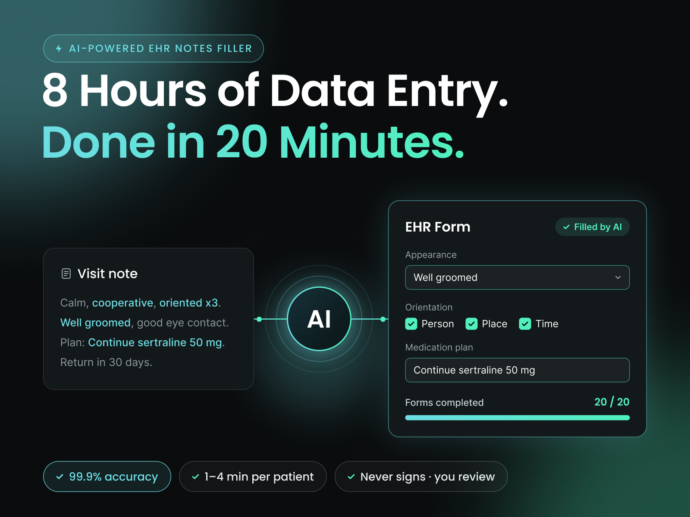
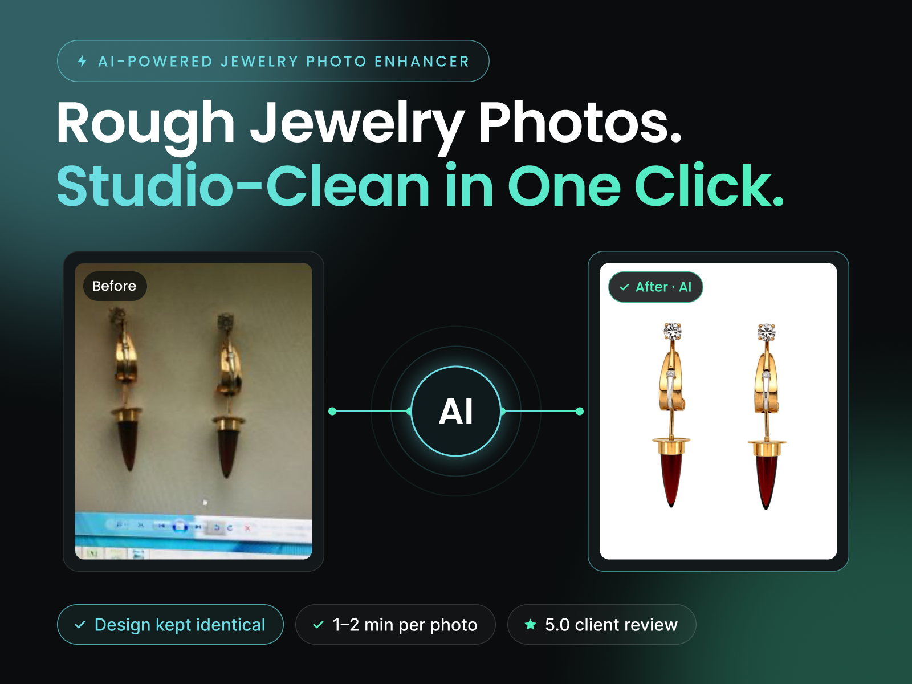
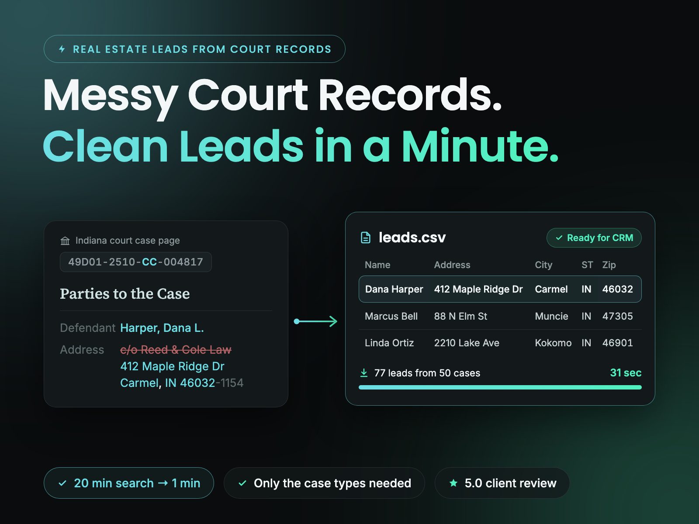
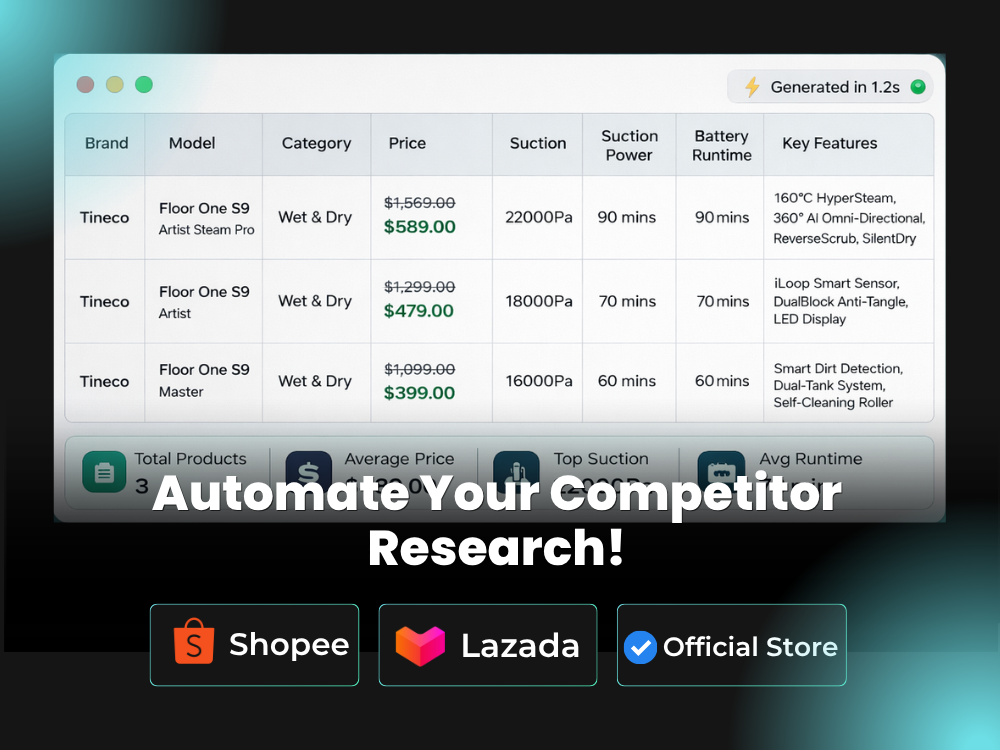

<h1 align="center">Hi, I'm Anas 👋</h1>

<h3 align="center">AI Automation Engineer · I automate the repetitive work that eats your team's day</h3>

  
  
  
  

---

If your team spends hours on the same computer tasks every week, I can probably automate them. Copying data between systems, filling the same forms, downloading reports one by one, researching leads, checking websites for changes.

I use whatever fits the job. An **n8n or Make** workflow when your apps already connect. A **custom Python tool** when a website has no API, needs a login or blocks bots. **AI** when a task needs judgement, like reading a messy note or deciding where each value belongs. Everything ships with a simple dashboard your team can run without code.

**30+ projects delivered · repeat clients in the US and Europe**

## 🛠️ What I automate

- **Data entry and form filling** in portals, CRMs, EHRs and other web systems
- **Reports, data collection and monitoring**, with alerts when something changes
- **Lead research and enrichment** for sales, real estate and local businesses
- **Web scraping and data extraction**, including sites with CAPTCHAs and bot protection
- **AI workflows** that read emails, documents and notes and turn them into clean data
- **App connections** with n8n, Make and Zapier

## 📂 Featured work

Most client code is private, so here are the results instead. Full stories are in my [Upwork portfolio](https://www.upwork.com/freelancers/~0126ad63d4dc77d5fa).

<table>
  <tr>
    <td width="50%" valign="top">
      
      
<b>AI EHR Notes Filler</b> A clinician's daily data entry, from 8 hours to about 20 minutes. 99.9% accuracy.

    </td>
    <td width="50%" valign="top">
      
      
<b>AI Jewelry Photo Enhancer</b> Rough photos to clean product shots in one click, design kept identical.

    </td>
  </tr>
  <tr>
    <td width="50%" valign="top">
      
      
<b>Court Records Lead Bot</b> Messy court records to CRM-ready leads. 20 minutes per search down to 1.

    </td>
    <td width="50%" valign="top">
      
      
<b>Competitor Specs & Price Tracker</b> Specs and prices from sites that blocked ChatGPT, delivered as one clean Excel file.

    </td>
  </tr>
</table>

## 🧰 Tools I use

<b>Workflow automation</b> 
  

<b>Browser automation and data collection</b> 
        

<b>AI</b> 
    

<b>Apps, data and deployment</b> 
       

<b>More tools</b>

 
BrowserForge · aiohttp · HTTPX · Requests · Parsel · Beautiful Soup · lxml · Pydantic · Flask · React · GitHub Actions · REST APIs · Excel and CSV exports

## 🤝 How I work

Tell me about the task and the tools you use today. I'll look at it and tell you honestly what can be automated, how, and what it will take. If I'm not the right fit, I'll say so.

<b>Have a task you want off your plate? <a href="mailto:muhammad.anas.yaseen.s608@gmail.com">Email me</a> or message me on <a href="https://www.upwork.com/freelancers/~0126ad63d4dc77d5fa">Upwork</a>.</b>

